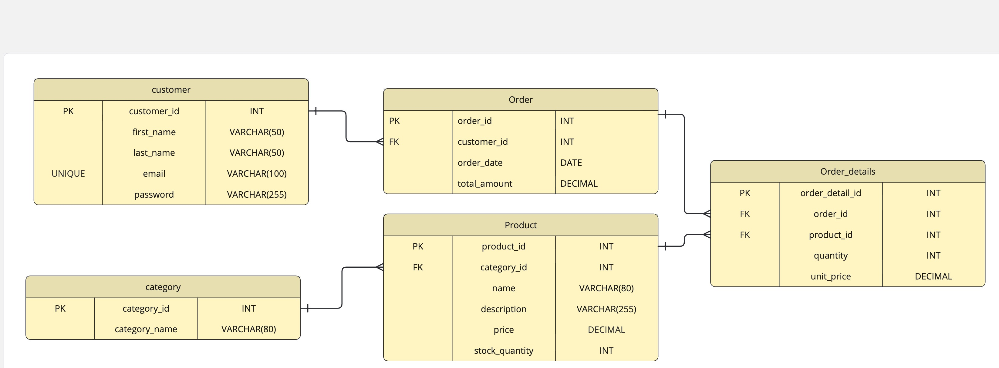

# E-Commerce Database Practice

This repository contains a simple e-commerce database schema used for practicing
SQL, ER modeling, and reporting queries.

The main entities are:

- **Category**: Stores product categories.
- **Product**: Stores products and their prices/stock.
- **Customer**: Stores customer accounts.
- **Order**: Stores customer orders (header).
- **Order_details**: Stores products inside each order (order lines).

---

## 1. Objectives

The goal of this mini-project is to:

1. Design the **database schema** using SQL (DDL).
2. Identify and implement the **relationships** between entities using primary keys and foreign keys.
3. Draw an **ERD diagram** for the schema.
4. Write several **reporting queries**:
   - Daily revenue report  
   - Monthly top-selling products  
   - High-value customers  
5. Discuss a possible **denormalization** mechanism for Customer & Order entities.

---

## 2. Database Schema (DDL)

Below is the SQL script used to create the schema and define all entity relationships:

```sql
CREATE TABLE category(
    category_id INT AUTO_INCREMENT PRIMARY KEY,
    category_name VARCHAR(80) NOT NULL
);

---

CREATE TABLE customer (
    customer_id INT AUTO_INCREMENT PRIMARY KEY,
    first_name VARCHAR(50) NOT NULL,
    last_name VARCHAR(50) NOT NULL,
    email VARCHAR(100) NOT NULL UNIQUE,
    password VARCHAR(255) NOT NULL
);

---

CREATE TABLE `orders` (
    order_id INT AUTO_INCREMENT PRIMARY KEY,
    customer_id INT NOT NULL,
    order_date DATE NOT NULL,
    total_amount DECIMAL(10,2),
    CONSTRAINT FK_order_customer
        FOREIGN KEY (customer_id)
        REFERENCES customer(customer_id)
        ON DELETE CASCADE
        ON UPDATE CASCADE
);

---

CREATE TABLE product (
    product_id INT AUTO_INCREMENT PRIMARY KEY,
    category_id INT NOT NULL,
    name VARCHAR(50) NOT NULL,
    description VARCHAR(200) NOT NULL,
    price DECIMAL(10,2) NOT NULL CHECK (price > 0),
    stock_quantity INT NOT NULL CHECK (stock_quantity >= 0),
    CONSTRAINT FK_product_category
        FOREIGN KEY (category_id)
        REFERENCES category(category_id)
        ON DELETE CASCADE
        ON UPDATE CASCADE
);

---

CREATE TABLE order_details (
    order_detail_id INT AUTO_INCREMENT PRIMARY KEY,
    order_id INT NOT NULL,
    product_id INT NOT NULL,
    quantity INT NOT NULL CHECK (quantity > 0),
    unit_price DECIMAL(10,2) NOT NULL CHECK (unit_price >= 0),
    CONSTRAINT FK_order_details_order
        FOREIGN KEY (order_id)
        REFERENCES orders(order_id)
        ON DELETE CASCADE
        ON UPDATE CASCADE,
    CONSTRAINT FK_order_details_product
        FOREIGN KEY (product_id)
        REFERENCES product(product_id)
        ON DELETE CASCADE
        ON UPDATE CASCADE
);
```

---

## 3. Relationships Between Entities

Below are the main relationships in this schema:

1. **Customer → Order**  
   - Relationship: **One-to-Many (1:N)**  
   - Explanation:  
     - One customer can place many orders.  
     - Each order belongs to exactly one customer.  
   - Implementation: `orders.customer_id` → `customer.customer_id`

2. **Order → Order_details**  
   - Relationship: **One-to-Many (1:N)**  
   - Explanation:  
     - One order can contain many order lines (order details).  
     - Each order_detail row belongs to exactly one order.  
   - Implementation: `order_details.order_id` → `orders.order_id`

3. **Product → Order_details**  
   - Relationship: **One-to-Many (1:N)**  
   - Explanation:  
     - One product can appear in many different order details (across different orders).  
     - Each order_detail row refers to exactly one product.  
   - Implementation: `order_details.product_id` → `product.product_id`

4. **Category → Product**  
   - Relationship: **One-to-Many (1:N)**  
   - Explanation:  
     - One category can have many products.  
     - Each product belongs to exactly one category.  
   - Implementation: `product.category_id` → `category.category_id`

5. **Order ↔ Product (via Order_details)**  
   - Logical Relationship: **Many-to-Many (M:N)**  
   - Explanation:  
     - One order can contain many products.  
     - One product can appear in many orders.  
     - This M:N relationship is implemented using the **Order_details** bridge table.

---

## 4. ERD Diagram



---

## 5. Reporting Queries

This section contains example SQL reporting queries based on the schema.

### 5.1. Daily Revenue Report

**Goal:** Get the total revenue for a specific date.

```sql
SELECT 
    order_date, 
    SUM(total_amount) AS daily_revenue
FROM orders
WHERE order_date = '2025-01-05';
```

### 5.2. Monthly Top-Selling Products

**Goal:** Retrieve the top-selling products (based on quantity sold) for a specific month.

```sql
SELECT 
    p.name AS top_selling_product, 
    SUM(od.quantity) AS total_quantity
FROM order_details od 
JOIN product p 
    ON p.product_id = od.product_id
JOIN orders o
    ON o.order_id = od.order_id
WHERE o.order_date >= '2025-01-01' 
  AND o.order_date <  '2025-02-01'
GROUP BY p.product_id, p.name
ORDER BY total_quantity DESC
LIMIT 5;
```

### 5.3. High-Value Customers (Complex Query)

**Goal:** Retrieve customers whose total order amount exceeds $500 within a given period, including their names and their total spending amount.

```sql
SELECT 
    c.first_name, 
    c.last_name, 
    SUM(o.total_amount) AS total_spent
FROM orders o
JOIN customer c 
    ON o.customer_id = c.customer_id
WHERE o.order_date >= '2025-01-01'
  AND o.order_date <  '2025-02-01'
GROUP BY c.customer_id, c.first_name, c.last_name
HAVING total_spent > 500;
```

---

## 6. Denormalization Discussion

In some cases, reporting queries that require customer information may become expensive due to frequent JOIN operations between the `orders` and `customer` tables. To optimize read performance, a denormalization approach can be applied by storing redundant customer data—such as `first_name` and `last_name`—directly inside the `orders` table.

**Benefits:**
- Faster reporting and analytics queries.
- Reduced reliance on JOIN operations.
- Improved read performance in systems with heavy reporting workloads.

**Drawbacks:**
- Data redundancy: customer names are duplicated across many orders.
- Update anomalies: if the customer updates their name, all related orders must be updated.
- Slightly increased storage usage.

This trade-off is common in analytical systems where read performance is more important than write efficiency.
