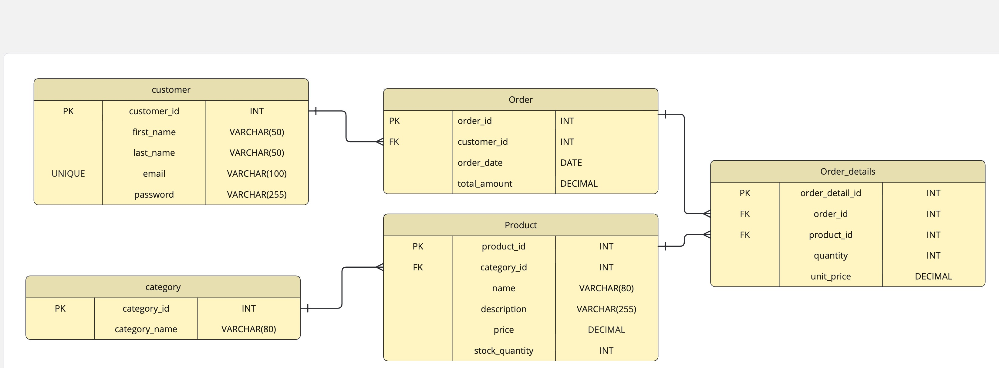

# E-Commerce Database Practice

This repository contains a simple e-commerce database schema used for practicing
SQL, ER modeling, and reporting queries.

The main entities are:

- **Category**: Stores product categories.
- **Product**: Stores products and their prices/stock.
- **Customer**: Stores customer accounts.
- **Order**: Stores customer orders (header).
- **Order_details**: Stores products inside each order (order lines).

---

## 1. Objectives

The goal of this mini-project is to:

1. Design the **database schema** using SQL (DDL).
2. Identify and implement the **relationships** between entities using primary keys and foreign keys.
3. Draw an **ERD diagram** for the schema.
4. Write several **reporting queries**:
   - Daily revenue report
   - Monthly top-selling products
   - High-value customers
5. Discuss a possible **denormalization** mechanism for Customer & Order entities.

---

## 2. Database Schema (DDL)

Below is the SQL script used to create the schema and define all entity relationships:

```sql
CREATE TABLE category(
    category_id INT AUTO_INCREMENT PRIMARY KEY,
    category_name VARCHAR(80) NOT NULL
);

---

CREATE TABLE customer (
    customer_id INT AUTO_INCREMENT PRIMARY KEY,
    first_name VARCHAR(50) NOT NULL,
    last_name VARCHAR(50) NOT NULL,
    email VARCHAR(100) NOT NULL UNIQUE,
    password VARCHAR(255) NOT NULL
);

---

CREATE TABLE `orders` (
    order_id INT AUTO_INCREMENT PRIMARY KEY,
    customer_id INT NOT NULL,
    order_date DATE NOT NULL,
    total_amount DECIMAL(10,2),
    CONSTRAINT FK_order_customer
        FOREIGN KEY (customer_id)
        REFERENCES customer(customer_id)
        ON DELETE CASCADE
        ON UPDATE CASCADE
);

---

CREATE TABLE product (
    product_id INT AUTO_INCREMENT PRIMARY KEY,
    category_id INT NOT NULL,
    name VARCHAR(50) NOT NULL,
    description VARCHAR(200) NOT NULL,
    price DECIMAL(10,2) NOT NULL CHECK (price > 0),
    stock_quantity INT NOT NULL CHECK (stock_quantity >= 0),
    CONSTRAINT FK_product_category
        FOREIGN KEY (category_id)
        REFERENCES category(category_id)
        ON DELETE CASCADE
        ON UPDATE CASCADE
);

---

CREATE TABLE order_details (
    order_detail_id INT AUTO_INCREMENT PRIMARY KEY,
    order_id INT NOT NULL,
    product_id INT NOT NULL,
    quantity INT NOT NULL CHECK (quantity > 0),
    unit_price DECIMAL(10,2) NOT NULL CHECK (unit_price >= 0),
    CONSTRAINT FK_order_details_order
        FOREIGN KEY (order_id)
        REFERENCES orders(order_id)
        ON DELETE CASCADE
        ON UPDATE CASCADE,
    CONSTRAINT FK_order_details_product
        FOREIGN KEY (product_id)
        REFERENCES product(product_id)
        ON DELETE CASCADE
        ON UPDATE CASCADE
);
```

---

## 3. Relationships Between Entities

Below are the main relationships in this schema:

1. **Customer → Order**

   - Relationship: **One-to-Many (1:N)**
   - Explanation:
     - One customer can place many orders.
     - Each order belongs to exactly one customer.
   - Implementation: `orders.customer_id` → `customer.customer_id`

2. **Order → Order_details**

   - Relationship: **One-to-Many (1:N)**
   - Explanation:
     - One order can contain many order lines (order details).
     - Each order_detail row belongs to exactly one order.
   - Implementation: `order_details.order_id` → `orders.order_id`

3. **Product → Order_details**

   - Relationship: **One-to-Many (1:N)**
   - Explanation:
     - One product can appear in many different order details (across different orders).
     - Each order_detail row refers to exactly one product.
   - Implementation: `order_details.product_id` → `product.product_id`

4. **Category → Product**

   - Relationship: **One-to-Many (1:N)**
   - Explanation:
     - One category can have many products.
     - Each product belongs to exactly one category.
   - Implementation: `product.category_id` → `category.category_id`

5. **Order ↔ Product (via Order_details)**
   - Logical Relationship: **Many-to-Many (M:N)**
   - Explanation:
     - One order can contain many products.
     - One product can appear in many orders.
     - This M:N relationship is implemented using the **Order_details** bridge table.

---

## 4. ERD Diagram



---

## 5. Reporting Queries

This section contains example SQL reporting queries based on the schema.

### 5.1. Daily Revenue Report

**Goal:** Get the total revenue for a specific date.

```sql
SELECT
    order_date,
    SUM(total_amount) AS daily_revenue
FROM orders
WHERE order_date = '2025-01-05';
```

### **5.2. Monthly Top-Selling Products**

There are **two types** of “top-selling” metrics used in e-commerce analytics:

### 🟡 **A. Top-Selling Products by Quantity (Units Sold)**

**Meaning:**  
Products ranked by the **number of items sold**, regardless of price.

**Example:**  
A **$10 T-shirt** sold **300 times**  
is ranked higher than a **$100 item** sold **20 times**.

```sql
SELECT
    p.name AS top_selling_product,
    SUM(od.quantity) AS total_quantity
FROM order_details od
JOIN product p
    ON p.product_id = od.product_id
JOIN orders o
    ON o.order_id = od.order_id
WHERE o.order_date >= '2025-01-01'
  AND o.order_date <  '2025-02-01'
GROUP BY p.product_id, p.name
ORDER BY total_quantity DESC
LIMIT 5;
```

### 🟡 **B. Top-Selling Products by Revenue (Money Earned)**

**Meaning:**  
Products ranked by **total revenue generated** (money earned).<br>
This is often the **true business definition** of “top-selling”.

**Example:**  
An **iPhone ($1000)** sold **5 units**<br>
earns more than a **$10 T-shirt** sold **100 units**.

```sql
SELECT
    p.name AS top_selling_product,
    SUM(od.quantity * od.unit_price) AS total_revenue
FROM order_details od
JOIN product p
    ON p.product_id = od.product_id
JOIN orders o
    ON o.order_id = od.order_id
WHERE o.order_date >= '2025-01-01'
  AND o.order_date <  '2025-02-01'
GROUP BY p.product_id, p.name
ORDER BY total_revenue DESC
LIMIT 5;
```

### 5.3. High-Value Customers (Complex Query)

**Goal:** Retrieve customers whose total order amount exceeds $500 within a given period, including their names and their total spending amount.

```sql
SELECT
    c.first_name,
    c.last_name,
    SUM(o.total_amount) AS total_spent
FROM orders o
JOIN customer c
    ON o.customer_id = c.customer_id
WHERE o.order_date >= '2025-01-01'
  AND o.order_date <  '2025-02-01'
GROUP BY c.customer_id, c.first_name, c.last_name
HAVING total_spent > 500;
```

### **5.4. Search for Products Containing a Keyword**

**Goal:** Find all products with the word `"camera"` in the name or description.

```sql
SELECT
    name,
    description
FROM product
WHERE name LIKE '%camera%'
   OR description LIKE '%camera%';
```

### **5.5. Recommend Popular Products in the Same Category and Same Author**

**Goal:**  
Suggest popular products related to an already purchased product based on:

- Same category
- Same author
- Excluding the purchased product
- Ranked by popularity (units sold)

```sql
SELECT
    p2.product_id,
    p2.name,
    p2.category_id,
    p2.author_id,
    COALESCE(SUM(od2.quantity), 0) AS total_sold
FROM product p1
JOIN product p2
  ON p2.category_id = p1.category_id
 AND p2.author_id   = p1.author_id
LEFT JOIN order_details od2
  ON od2.product_id = p2.product_id
WHERE p1.product_id = :purchased_product_id
  AND p2.product_id <> p1.product_id
GROUP BY
    p2.product_id,
    p2.name,
    p2.category_id,
    p2.author_id
ORDER BY total_sold DESC;
```

---

## 6. Denormalization Discussion

In some cases, reporting queries that require customer information may become expensive due to frequent JOIN operations between the `orders` and `customer` tables. To optimize read performance, a denormalization approach can be applied by storing redundant customer data—such as `first_name` and `last_name`—directly inside the `orders` table.

**Benefits:**

- Faster reporting and analytics queries.
- Reduced reliance on JOIN operations.
- Improved read performance in systems with heavy reporting workloads.

**Drawbacks:**

- Data redundancy: customer names are duplicated across many orders.
- Update anomalies: if the customer updates their name, all related orders must be updated.
- Slightly increased storage usage.

This trade-off is common in analytical systems where read performance is more important than write efficiency.

---

## 7. Sale History Trigger (Automatic Sales Logging)

To support analytics and reporting use cases, a **sale history mechanism** was implemented using a database trigger.  
This trigger automatically records sales data whenever a new order line is inserted.

### 7.1. Purpose

The goal of this trigger is to:

- Capture **sales transactions automatically**
- Store a **denormalized snapshot** of sales data
- Improve performance for reporting and analytics queries
- Avoid expensive joins between `orders`, `order_details`, and `customer`

Each row inserted into `order_details` represents a real sale line, making it the ideal trigger point.

---

### 7.2. Sale History Table

The `sale_history` table stores a snapshot of each sold product at the time of purchase.

```sql
CREATE TABLE sale_history (
    sale_id INT AUTO_INCREMENT PRIMARY KEY,
    order_id INT NOT NULL,
    order_date DATE NOT NULL,
    customer_id INT NOT NULL,
    product_id INT NOT NULL,
    quantity INT NOT NULL,
    unit_price DECIMAL(10,2) NOT NULL,
    line_total DECIMAL(10,2) NOT NULL,
    created_at TIMESTAMP DEFAULT CURRENT_TIMESTAMP
);
```

---

### 7.3. Trigger: Create Sale History on Order Line Insert

The following trigger is executed **after inserting a new row into order_details.** <br>
It combines data from the newly inserted order line and its related order header.

```sql
-- Change delimiter to allow multiple SQL statements in trigger
DELIMITER $$
-- Trigger: Automatically create a sale history record
-- Fired after inserting a new order line (order_details)
CREATE TRIGGER trg_create_sale_history
AFTER INSERT ON order_details
-- FOR EACH ROW = trigger executes once per inserted row
FOR EACH ROW
BEGIN
    INSERT INTO sale_history (
        order_id,
        order_date,
        customer_id,
        product_id,
        quantity,
        unit_price,
        line_total
    )
    -- NEW = refers to the inserted order_details row
    -- Using SELECT allows mixing data from orders + order_details
    SELECT
        o.order_id,
        o.order_date,
        o.customer_id,
        NEW.product_id,
        NEW.quantity,
        NEW.unit_price,
        NEW.quantity * NEW.unit_price
    FROM orders o
    WHERE o.order_id = NEW.order_id;
END;

-- Restore default delimiter
DELIMITER ;
```

---

### 7.4. Trigger Execution Example

```sql
INSERT INTO order_details (order_id, product_id, quantity, unit_price)
VALUES (1, 5, 2, 150);
```

This automatically generates the following record in sale_history:

| sale_id | order_id | order_date | customer_id | product_id | quantity | unit_price | line_total | created_at          |
| ------: | -------: | ---------- | ----------: | ---------: | -------: | ---------: | ---------: | ------------------- |
|       1 |        1 | 2025-01-05 |           1 |          5 |        2 |        150 |        300 | 2025-12-20 10:18:29 |

---

### 7.5. Design Notes

- The trigger runs **AFTER INSERT** to ensure all NEW.\* values exist.
- `order_details` is used instead of orders because it contains actual sales data.
- `sale_history` is intentionally denormalized for fast reporting.
- One `order_details` row = one real sales transaction.
- This approach is commonly used in analytical and reporting systems.

---

### Lock Quantity Field for a Product

Although the requirement is to lock a single field (`stock_quantity`),  
MySQL applies locks at the **row level**, not the column level.

The following example demonstrates how this is achieved using transactions.

##

#### Transaction A (Lock Holder)

```sql
START TRANSACTION;

-- Locks the row that contains product_id = 211
-- Prevents other transactions from updating stock_quantity
SELECT stock_quantity
FROM product
WHERE product_id = 211
FOR UPDATE;
```

The transaction remains open and holds the lock on the row.

##

#### Transaction B (Blocked Transaction)

```sql
UPDATE product
SET stock_quantity = stock_quantity + 1
WHERE product_id = 211;
```

This update will be blocked until Transaction A commits or rolls back.

##

#### Release the Lock

```sql
COMMIT;
```

Once the transaction is committed, the lock is released and
Transaction B continues execution.

**Note:**
Even though the intention is to lock a single column,
InnoDB enforces locking at the row level, not the column level.

---

### Lock an Entire Product Row

In this task, the goal is to explicitly lock the entire row of a product
to prevent any updates or deletions by other transactions.

##

#### Transaction A (Row Lock Holder)

```sql
START TRANSACTION;

-- Locks the entire row for product_id = 211
SELECT *
FROM product
WHERE product_id = 211
FOR UPDATE;
```

The transaction holds an exclusive lock on the selected row.

##

#### Transaction B (Blocked Transaction)

```sql
UPDATE product
SET stock_quantity = 0
WHERE product_id = 211;
```

This statement will be blocked until the lock is released.

##

#### Release the Lock

```sql
COMMIT;
```

After committing, the row lock is released and other transactions may proceed.

---

### Full-Text Search on Products

This section demonstrates how **Full-Text Search** can be used to search text-based
columns more efficiently than traditional `LIKE` queries.

A FULLTEXT index is required on the searchable columns before running these queries.

##

#### Create Full-Text Index

```sql
CREATE FULLTEXT INDEX idx_product_text_search
ON product (name, description);
```

##

#### Query 1: Basic Full-Text Search

This query retrieves all products that contain the keyword `"camera"`
in either the product name or description using Full-Text Search.

```sql
SELECT *
FROM product
WHERE MATCH(name, description)
AGAINST ('camera');
```

**Explanation:**

- Uses the FULLTEXT index to search text efficiently
- Returns matching rows only (true / false match)
- Does not rank results by relevance
- Result order is not guaranteed

##

#### Query 2: Full-Text Search with Relevance Ranking

This query improves the basic full-text search by calculating a **relevance score**
and ordering the results from most relevant to least relevant.

```sql
SELECT
    product_id,
    name,
    description,

    -- Calculates how relevant each row is to the search keyword
    -- Higher score means a better match
    MATCH(name, description) AGAINST ('camera') AS relevance_score

FROM product

-- Filters rows that match the full-text search condition
WHERE MATCH(name, description)
AGAINST ('camera')

-- Orders results so the most relevant products appear first
ORDER BY relevance_score DESC;
```

**Explanation:**

- `MATCH(...) AGAINST(...)` computes a relevance score for each row
- The score is based on:
  - Term frequency
  - Term location (name vs description)
  - Overall text distribution
- Results are sorted by relevance, similar to a search engine
- Suitable for search bars and product discovery features

---

## 8. Test Data Generation (Bulk Inserts)

To practice performance tuning and query optimization on realistic workloads,
the database needs large-scale test data (hundreds of thousands to millions of rows).

This section provides **stored procedures** to generate bulk data for:

- categories
- products
- customers
- orders + order_details (based on existing customers/products)

> Note:
> In MySQL, **stored procedures** are the recommended way for bulk inserts.
> Using `FUNCTION` for inserts is generally discouraged because functions should avoid data side effects.

---

### 8.1. Generate Categories (~100 rows)

This procedure inserts a number of categories with unique names.

```sql
DELIMITER $$

CREATE PROCEDURE insert_bulk_categories(IN total_rows INT)
BEGIN
    DECLARE i INT DEFAULT 1;

    START TRANSACTION;

    WHILE i <= total_rows DO
        INSERT INTO category (category_name)
        VALUES (CONCAT('Category ', i));

        SET i = i + 1;
    END WHILE;

    COMMIT;
END$$

DELIMITER ;
```

Run:

```sql
CALL insert_bulk_categories(100);
```

Verify:

```sql
SELECT COUNT(*) FROM category;
```

---

### 8.2. Generate Products (~100K rows)

This procedure inserts a large number of products.
Each product is assigned to a random category.

> Requirement: Make sure categories exist first.

```sql
DELIMITER $$

CREATE PROCEDURE insert_bulk_products(IN total_rows INT)
BEGIN
    DECLARE i INT DEFAULT 1;
    DECLARE random_category INT;
    DECLARE random_price DECIMAL(10,2);
    DECLARE random_stock INT;
    DECLARE max_category_id INT;

    -- Get max category_id to generate valid FK values
    SELECT MAX(category_id) INTO max_category_id FROM category;

    START TRANSACTION;

    WHILE i <= total_rows DO
        SET random_category = FLOOR(1 + RAND() * max_category_id);
        SET random_price    = ROUND(10 + RAND() * 990, 2);
        SET random_stock    = FLOOR(RAND() * 500);

        INSERT INTO product (
            category_id,
            name,
            description,
            price,
            stock_quantity
        )
        VALUES (
            random_category,
            CONCAT('Product ', i),
            CONCAT('Description for product ', i),
            random_price,
            random_stock
        );

        SET i = i + 1;
    END WHILE;

    COMMIT;
END$$

DELIMITER ;
```

Run:

```sql
CALL insert_bulk_products(100000);
```

Verify:

```sql
SELECT COUNT(*) FROM product;
```

---

### 8.3. Generate Customers (~1,000,000 Rows)

This procedure inserts approximately one million customers.

Special care is taken to ensure that the `email` column remains **unique**,
as required by the table constraint.

```sql
DELIMITER $$

CREATE PROCEDURE insert_bulk_customers(IN total_rows INT)
BEGIN
    DECLARE i INT DEFAULT 1;

    START TRANSACTION;

    WHILE i <= total_rows DO
        INSERT INTO customer (
            first_name,
            last_name,
            email,
            password
        )
        VALUES (
            CONCAT('First', i),
            CONCAT('Last', i),
            CONCAT('user', i, '@example.com'),
            CONCAT('hashed_password_', i)
        );

        SET i = i + 1;
    END WHILE;

    COMMIT;
END$$

DELIMITER ;
```

Run:

```sql
CALL insert_bulk_customers(1000000);
```

Verify:

```sql
SELECT COUNT(*) FROM customer;
```

---

### 8.4. Generate Orders and Order Details (~5 Million Rows)

To simulate a realistic high-traffic e-commerce system and enable advanced
performance testing, this step generates **large-scale transactional data**
for both `orders` and `order_details` tables.

The generated data is fully based on:

- Existing customers in the `customer` table
- Existing products and prices in the `product` table

Target volume (adopted strategy):

- **800,000 orders**
- **5 to 8 order lines** per order
- Total `order_details` ≈ 5,000,000 rows

> **Important:**<br>
> If the sale_history trigger is enabled, inserting ~5M order lines will also
> insert ~5M rows into sale_history. This is expected, but it will increase runtime.

##

#### 8.4.1. Stored Procedure: Bulk Orders + Order Details

This stored procedure:

- Inserts rows into `orders`
- Inserts multiple rows into `order_details` per order
- Calculates and updates `orders.total_amount`
- Generates random order dates within a defined range

```sql
DELIMITER $$

CREATE PROCEDURE insert_bulk_orders_and_details(
    IN total_orders INT,
    IN min_lines_per_order INT,
    IN max_lines_per_order INT,
    IN start_date DATE,
    IN end_date DATE
)
BEGIN
    DECLARE o INT DEFAULT 1;
    DECLARE l INT;
    DECLARE lines_count INT;

    DECLARE random_customer_id INT;
    DECLARE random_product_id INT;
    DECLARE random_qty INT;
    DECLARE unit_price_val DECIMAL(10,2);

    DECLARE order_total DECIMAL(10,2);
    DECLARE new_order_id INT;

    DECLARE min_customer_id INT;
    DECLARE max_customer_id INT;
    DECLARE min_product_id INT;
    DECLARE max_product_id INT;

    DECLARE day_range INT;

    -- Fetch ID ranges to generate valid foreign keys
    SELECT MIN(customer_id), MAX(customer_id)
    INTO min_customer_id, max_customer_id
    FROM customer;

    SELECT MIN(product_id), MAX(product_id)
    INTO min_product_id, max_product_id
    FROM product;

    SET day_range = DATEDIFF(end_date, start_date);

    START TRANSACTION;

    WHILE o <= total_orders DO
        -- Pick random customer
        SET random_customer_id =
            FLOOR(min_customer_id + RAND() * (max_customer_id - min_customer_id + 1));

        -- Insert order header
        INSERT INTO orders (customer_id, order_date, total_amount)
        VALUES (
            random_customer_id,
            DATE_ADD(start_date, INTERVAL FLOOR(RAND() * (day_range + 1)) DAY),
            0
        );

        SET new_order_id = LAST_INSERT_ID();
        SET order_total = 0;

        -- Determine number of order lines
        SET lines_count =
            FLOOR(min_lines_per_order + RAND() *
                 (max_lines_per_order - min_lines_per_order + 1));

        SET l = 1;

        WHILE l <= lines_count DO
            -- Pick random product
            SET random_product_id =
                FLOOR(min_product_id + RAND() * (max_product_id - min_product_id + 1));

            -- Quantity between 1 and 5
            SET random_qty = FLOOR(1 + RAND() * 5);

            -- Fetch product price
            SELECT price
            INTO unit_price_val
            FROM product
            WHERE product_id = random_product_id;

            INSERT INTO order_details (order_id, product_id, quantity, unit_price)
            VALUES (new_order_id, random_product_id, random_qty, unit_price_val);

            SET order_total = order_total + (random_qty * unit_price_val);
            SET l = l + 1;
        END WHILE;

        -- Update total order amount
        UPDATE orders
        SET total_amount = order_total
        WHERE order_id = new_order_id;

        SET o = o + 1;

        -- Optional batching for very large datasets
        -- IF (o % 10000 = 0) THEN
        --     COMMIT;
        --     START TRANSACTION;
        -- END IF;

    END WHILE;

    COMMIT;
END$$

DELIMITER ;
```

##

#### 8.4.2. Run (Adopted Strategy – ~5M Order Lines)

```sql
CALL insert_bulk_orders_and_details(
    800000,      -- total orders
    5,           -- min order lines
    8,           -- max order lines
    '2024-01-01',
    '2025-12-31'
);
```

##

#### 8.4.3. Verification Queries

```sql
-- Total orders
SELECT COUNT(*) AS total_orders FROM orders;

-- Total order lines
SELECT COUNT(*) AS total_order_details FROM order_details;

-- Date distribution
SELECT
    MIN(order_date) AS min_order_date,
    MAX(order_date) AS max_order_date
FROM orders;
```

---

## 9. Products Count per Category – Performance Analysis (Task 5)

This section analyzes a query that retrieves the total number of products
assigned to each category, including categories that do not contain any products.
The focus is on understanding the execution plan and validating index usage
rather than rewriting the query unnecessarily.

---

### Query

```sql
SELECT
  c.category_id,
  c.category_name,
  COUNT(p.product_id) AS total_products
FROM category c
LEFT JOIN product p
  ON p.category_id = c.category_id
GROUP BY
  c.category_id,
  c.category_name
ORDER BY total_products DESC;
```

##

### Why LEFT JOIN?

- Ensures that categories with zero products are still returned.
- Preserves complete category visibility.

##

### 🔍 Execution Plan Analysis (EXPLAIN ANALYZE)

Key observations from `EXPLAIN ANALYZE`:

- The `category` table is scanned once (only ~100 rows).
- The `product` table is accessed using a **covering index** on `category_id`.
- No full table scan is performed on the `product` table.
- Aggregation is performed using a temporary table (expected for `GROUP BY`).
- Sorting is applied on the aggregated result set (100 rows only).

This confirms an efficient execution plan with optimal index usage.

##

### ⚙️ Optimization Technique Applied

- Verified that `product(category_id)` is indexed and used as a **covering index**.
- Ensured accurate optimizer statistics using `ANALYZE TABLE`.
- No query rewrite was required since the execution plan was already optimal.

```sql
ANALYZE TABLE category, product;
```

>**Optional optimizations (not applied):**
>
>- Removing `ORDER BY` if ordering is not required.
>- Replacing `LEFT JOIN` with `INNER JOIN` if empty categories are not needed.

##

### 📊 Optimization Log Entry

| Task | Simple Query | Execution Time Before | Optimization Technique | Rewrite Query | Execution Time After |
|------|-------------|------------------------|------------------------|--------------|----------------------|
| 5 | Count products per category | ~73.7 ms | FK index on product(category_id) used as a covering index + updated statistics | Same query | ~73–85 ms |


---

## 10. Customer Total Spending – Performance Analysis (Task 6)

This section analyzes a query that calculates the **total spending per customer**
by aggregating order amounts.  
The focus is on understanding performance bottlenecks, improving execution strategy,
and measuring the impact of each optimization step.

##

### Phase 1: Baseline Query (JOIN then GROUP BY)

The initial approach joins the `customer` and `orders` tables first, then aggregates
the results.

```sql
SELECT
  c.customer_id,
  CONCAT(c.first_name, ' ', c.last_name) AS customer_name,
  SUM(o.total_amount) AS total_spending
FROM customer c
JOIN orders o
  ON c.customer_id = o.customer_id
GROUP BY c.customer_id, c.first_name, c.last_name;
```

##

### 🔍 EXPLAIN ANALYZE – Key Observations

Based on the execution plan analysis, the following behavior was observed:

* The `orders` table is fully scanned (~800,000 rows).
* For **each order row**, MySQL performs a single-row lookup on the `customer` table
  using the **PRIMARY KEY** (nested-loop join).
* Aggregation is executed using a **temporary table**.
* Approximately **541,875 customer groups** are produced after aggregation.

**Measured execution time:** ~4.6–4.7 seconds

This approach is **logically correct**, but **inefficient** from a performance perspective
because the `JOIN` is executed **before aggregation**, resulting in:

* Repeated lookups on the `customer` table
* Increased CPU and I/O cost
* Poor scalability as data volume grows

##

### Phase 2: Rewrite – Aggregate First, Then JOIN

To reduce the overall join cost, the aggregation step is moved **earlier** in the query
execution flow.

Instead of joining `customer` and `orders` first, the query:

1. Aggregates the `orders` table **by `customer_id`**
2. Produces a smaller intermediate result set
3. Joins the aggregated result with the `customer` table **only once per customer**

This strategy significantly reduces:

* The number of JOIN operations
* The size of intermediate datasets
* Overall execution time

The rewritten approach aligns better with how relational optimizers handle
large-scale analytical queries.

```sql
WITH customer_spending AS (
  SELECT
    customer_id,
    SUM(total_amount) AS total_spending
  FROM orders
  GROUP BY customer_id
)
SELECT
  c.customer_id,
  CONCAT(c.first_name, ' ', c.last_name) AS customer_name,
  cs.total_spending
FROM customer_spending cs
JOIN customer c
  ON c.customer_id = cs.customer_id;
```

### 🔍 EXPLAIN ANALYZE – Key Observations (After Rewrite)

The execution plan after rewriting the query shows a clear improvement:

* MySQL performs a **grouped aggregation on the `orders` table first**.
* An **index scan** is used on `orders(customer_id)` (foreign key index).
* The `JOIN` with `customer` now occurs **once per aggregated customer**
  (~541,876 rows) instead of once per order row.
* Temporary table usage remains **expected and acceptable** for aggregation.

**Measured execution time:** ~2.6 seconds

✅ This rewrite **significantly reduces join overhead**, cutting execution time
from approximately **~4.7 seconds to ~2.6 seconds**.

##

### Phase 3: Top-N Optimization (ORDER BY + LIMIT)

If the business requirement is to retrieve **only the top spending customers**,
the result set can be reduced even further.

By applying `ORDER BY` combined with `LIMIT`, MySQL needs to:

* Sort a **much smaller result set**
* Return only the most relevant customers
* Reduce memory usage and execution time

This optimization is especially effective for dashboards,
leaderboards, and reporting screens where only the **top N results**
are required.

```sql
WITH customer_spending AS (
  SELECT
    customer_id,
    SUM(total_amount) AS total_spending
  FROM orders
  GROUP BY customer_id
)
SELECT
  c.customer_id,
  CONCAT(c.first_name, ' ', c.last_name) AS customer_name,
  cs.total_spending
FROM customer_spending cs
JOIN customer c
  ON c.customer_id = cs.customer_id
ORDER BY cs.total_spending DESC
LIMIT 100;
```

### 🔍 EXPLAIN ANALYZE – Key Observations (Top-N Optimization)

After applying `ORDER BY` with `LIMIT`, the execution plan shows further improvements:

* Aggregation is still performed on **all customers** (~541,000 rows).
* A **sort operation** is applied on the aggregated result set.
* The `JOIN` with the `customer` table is executed **only for the top 100 rows**
  due to the `LIMIT` clause.
* This drastically reduces both **join cost** and **result-processing overhead**.

**Measured execution time:** ~1.7–1.8 seconds

✅ This is the **best-performing option** when only the **top spending customers**
are required.

---

## Optimization Summary

Key performance insights from this task:

* Aggregating data **as early as possible** significantly reduces expensive JOIN operations.
* Limiting the result set using `LIMIT` minimizes unnecessary data processing and sorting.
* Proper index usage on `orders(customer_id)` is **critical** for efficient grouping and aggregation.
* Each optimization step was applied **independently** to clearly measure and understand its impact.

This step-by-step optimization approach mirrors real-world performance tuning workflows
used in analytical and reporting-heavy systems.

##

### 📊 Optimization Log Entry

| Task | Simple Query | Execution Time Before | Optimization Technique | Rewrite Query | Execution Time After |
|------|-------------|------------------------|------------------------|--------------|----------------------|
| 6 | Total spending per customer | ~4.7s | Aggregate first (GROUP BY in orders), use FK index | CTE aggregate then JOIN | ~2.6s |
| 6 | Top 100 spending customers | ~2.6s | Add `ORDER BY total_spending DESC LIMIT 100` | CTE + Top-N query | ~1.7–1.8s |


---

## 11. Most Recent Orders (1000) with Customer Info – Performance Analysis (Task 7)

This section retrieves the **most recent 1000 orders** along with customer details.
The main performance challenge is the `ORDER BY + LIMIT` on a large `orders` table.
Without a supporting index, MySQL must scan and sort a large portion of the table.

##

### Simple Query (Before Optimization)

```sql
SELECT
  o.order_id,
  o.order_date,
  o.total_amount,
  c.customer_id,
  CONCAT(c.first_name, ' ', c.last_name) AS customer_name,
  c.email
FROM orders o
JOIN customer c
  ON c.customer_id = o.customer_id
ORDER BY o.order_date DESC, o.order_id DESC
LIMIT 1000;
```

##

### 🔍 Execution Plan Analysis (Before)

Key observations from EXPLAIN ANALYZE:

* orders was read using a **full table scan** (~800K rows).
* MySQL performed a **large sort** on (order_date, order_id) to find the latest 1000 rows.
* The join to customer was efficient (PK lookup) but it happened after the expensive sort.

This explains the slower runtime (~341 ms).

##

### ⚙️ Optimization Technique Applied

To avoid sorting a large dataset, a composite index was created to match the ordering:

```sql
CREATE INDEX idx_orders_recent
ON orders (order_date, order_id, customer_id);

ANALYZE TABLE orders, customer;
```

Why this helps:

* The index is ordered by (order_date, order_id), so MySQL can scan it in reverse order
to fetch the latest rows directly.
* customer_id is included to support reading join keys directly from the index.

##

### Rewrite Query (After Optimization)

Instead of sorting the entire orders table, we first select only the latest 1000 orders
(using the index), then join the reduced set to customer.

```sql
WITH recent_orders AS (
  SELECT
    order_id,
    customer_id,
    order_date,
    total_amount
  FROM orders
  ORDER BY order_date DESC, order_id DESC
  LIMIT 1000
)
SELECT
  ro.order_id,
  ro.order_date,
  ro.total_amount,
  c.customer_id,
  CONCAT(c.first_name, ' ', c.last_name) AS customer_name,
  c.email
FROM recent_orders ro
JOIN customer c
  ON c.customer_id = ro.customer_id
ORDER BY ro.order_date DESC, ro.order_id DESC;
```

##

### ✅ Execution Plan Improvement (After)

* MySQL used **Index scan on orders using idx_orders_recent (reverse)** to fetch only 1000 rows.
* No large sort was required (only sorting 1000 rows, which is cheap).
* Join to customer remained efficient (PK lookup).

Runtime improved significantly:

* Before: ~341 ms
* After: ~6–12 ms

##

### 📊 Optimization Log Entry

| Task | Simple Query | Execution Time Before | Optimization Technique | Rewrite Query | Execution Time After |
|------|-------------|------------------------|------------------------|--------------|----------------------|
| 7 | Most recent 1000 orders + customer info | ~341 ms | Composite index for ORDER BY + LIMIT, updated statistics, CTE to limit before JOIN | CTE recent_orders + JOIN customer | ~6–12 ms |


---

### 12. Low Stock Products (< 10) – Performance Analysis (Task 8)

This section lists products that have low stock quantities (less than 10),
which is a common operational query for inventory monitoring and restocking.

---

### Query (Simple)

```sql
SELECT
  product_id,
  name,
  stock_quantity
FROM product
WHERE stock_quantity < 10
ORDER BY stock_quantity ASC;
```

##

### 🔍 Execution Plan (Before Optimization)

Key observations from EXPLAIN ANALYZE:

* MySQL performed a **full table scan** on product (100,000 rows).
* A filter was applied to keep only rows where stock_quantity < 10 (1,946 rows).
* A **sort step** was required to order the filtered result set.

This was expected, but not optimal for large datasets.

##

### ⚙️ Optimization Techniques Tested

1) Normal Index on stock_quantity

```sql
CREATE INDEX idx_stock_quantity ON product (stock_quantity);
ANALYZE TABLE product;
```

Result:

* MySQL used an **index range scan** to fetch only rows where stock_quantity < 10.
* However, the query still needed to fetch product_id and name from the table (not covered by the index).

2) Covering Index (Adopted – Best Result)

A covering index ensures that all selected columns are available from the index itself,
so MySQL does not need extra lookups into the table.

```sql
CREATE INDEX idx_stock_quantity_covering
ON product (stock_quantity, product_id, name);

ANALYZE TABLE product;
```

Result:

* MySQL used a **covering index range scan.**
* No full table scan.
* No additional table lookups were needed.
* This produced the best runtime improvement.

> **Note:**<br>
> MySQL does not support partial/conditional indexes like:
> CREATE INDEX ... WHERE stock_quantity < 10 (supported in PostgreSQL, not MySQL).

##

### 📊 Optimization Log Entry

| Task | Simple Query | Execution Time Before | Optimization Technique | Rewrite Query | Execution Time After |
|------|-------------|------------------------|------------------------|--------------|----------------------|
| 8 | Low stock products (< 10) | ~123 ms | Covering index on (stock_quantity, product_id, name) + ANALYZE TABLE | Same query | ~2.3 ms |